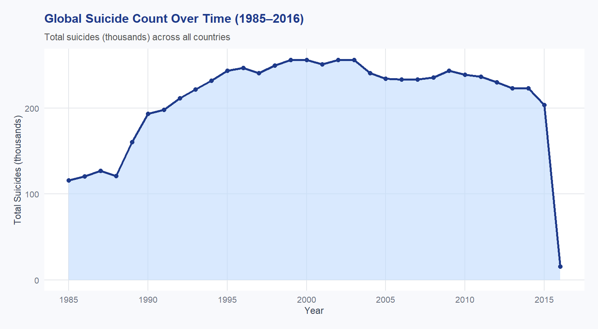
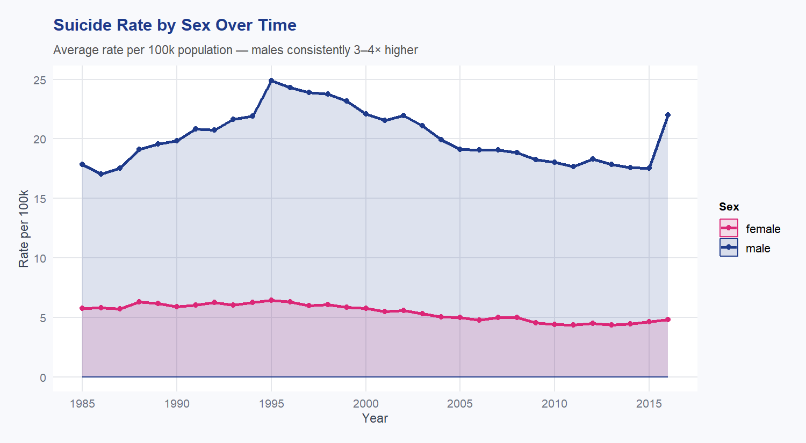
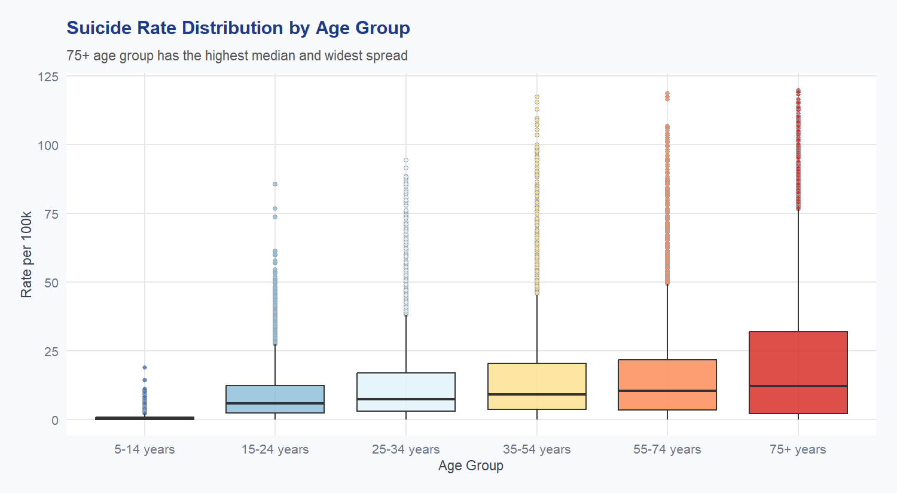
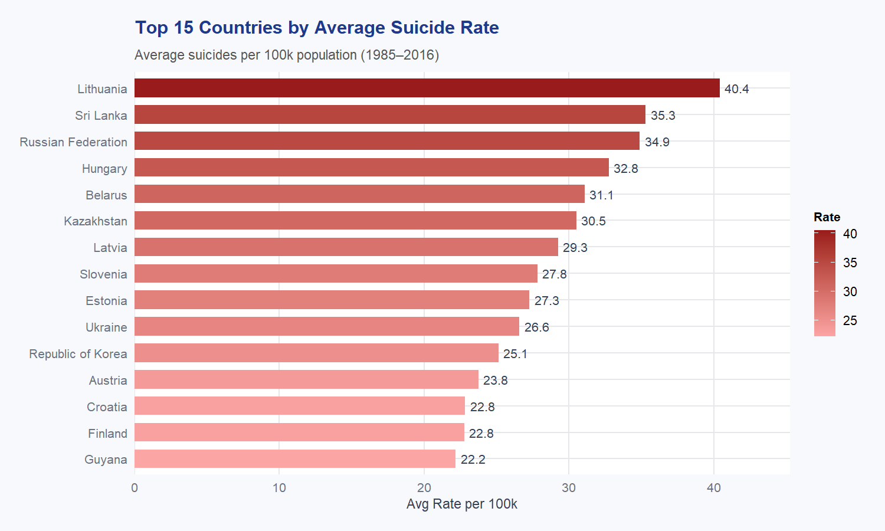
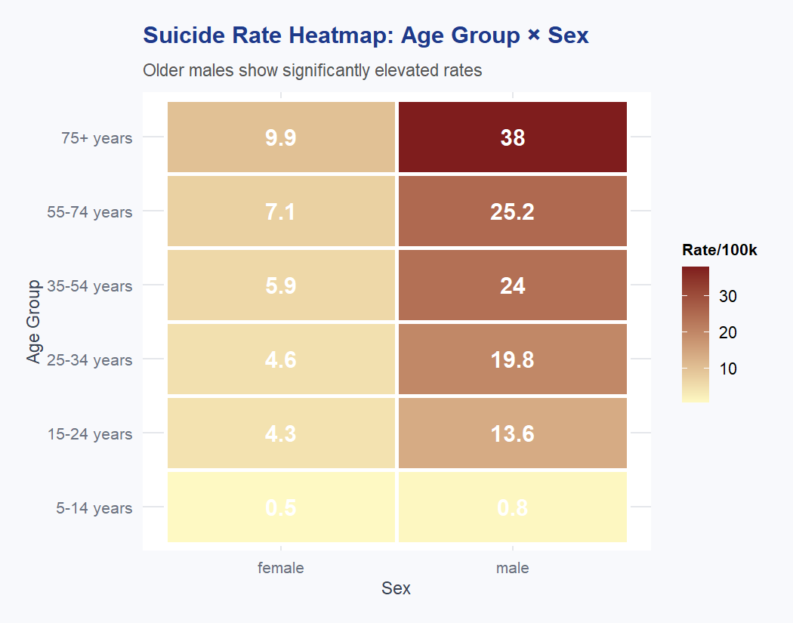
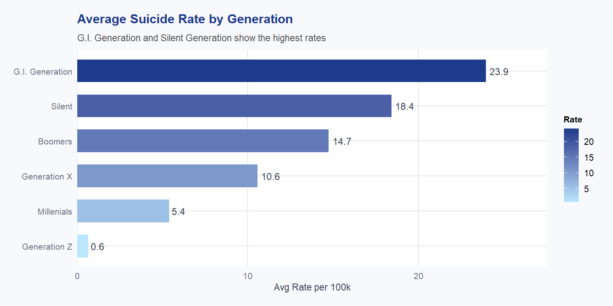
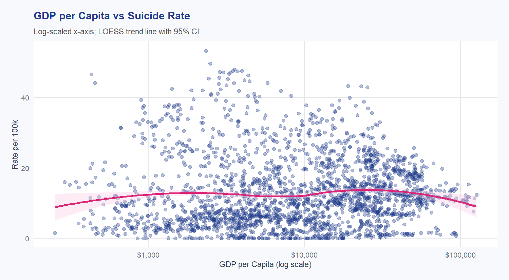
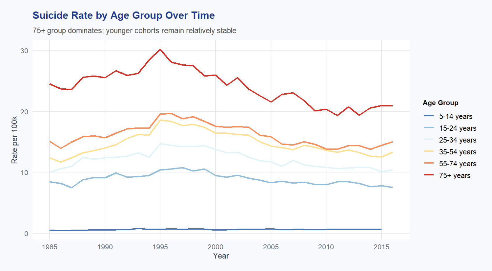

# 📊 Global Suicide Statistics – Interactive Shiny Dashboard

> **CSI3005 – Advanced Data Visualization Techniques**  
> Case Study | Winter Semester 2025–26 | VIT Vellore (SCOPE)

[](https://bharathpalanisamymettukadai.shinyapps.io/r-prog/)
[](https://github.com/bharath-mp-2005/ADVT-Case-Study-Shiny-Dashboard)
[](https://shiny.posit.co/)

---

## 🌐 Live Demo

**👉 [https://bharathpalanisamymettukadai.shinyapps.io/r-prog/](https://bharathpalanisamymettukadai.shinyapps.io/r-prog/)**

---

## 📁 Project Structure

```
ADVT-Case-Study-Shiny-Dashboard/
├── app.R                    # Main Shiny application (UI + Server)
├── master.csv               # WHO Suicide Statistics dataset
├── generate_plots.R         # Script to regenerate all analysis images
├── images/
│   ├── plot1_global_trend.png
│   ├── plot2_sex_trend.png
│   ├── plot3_age_boxplot.png
│   ├── plot4_top_countries.png
│   ├── plot5_heatmap.png
│   ├── plot6_generation.png
│   ├── plot7_gdp_scatter.png
│   └── plot8_age_trend.png
└── README.md
```

---

## 📌 About

This project is an interactive multi-tab dashboard built using **R Shiny** to analyse the **WHO Global Suicide Statistics dataset (1985–2016)**. It covers 101 countries and ~27,820 records, enabling exploration of suicide trends across sex, age group, generation, country, and economic indicators.

| Detail | Info |
|---|---|
| **Student** | Bharath Palanisamy Mettukadai |
| **Reg No** | 23MID0014 |
| **Course** | CSI3005 – Advanced Data Visualization Techniques |
| **Faculty** | Dr. Ramesh C [20139] |
| **Tool** | R Shiny + shinydashboard + plotly |
| **Dataset** | WHO Suicide Statistics (Kaggle) |

---

## 📊 Analysis & Results

### 1. Global Suicide Trend (1985–2016)

> Total suicides rose steadily from ~115k in 1985, peaked around **1995–2000 (~260k)**, then gradually declined through 2015. The sharp drop at 2016 reflects **incomplete country reporting** for that year, not an actual global decline.

---

### 2. Suicide Rate by Sex Over Time

> The male rate ranged between **17–25 per 100k** while the female rate stayed consistently low at **5–6 per 100k** — males are **3.5–4× higher** throughout the entire period. Both sexes peaked around **1994–1995**.

---

### 3. Rate Distribution by Age Group

> The **75+ age group** has the highest median (~14) and widest spread with outliers exceeding 120/100k. The **5–14 group** is nearly flat at zero. The 35–54 group shows the most extreme outliers due to its large population share across many countries.

---

### 4. Top 15 Countries by Suicide Rate

> **Lithuania leads at 40.4/100k**, followed by **Sri Lanka (35.3)** and **Russian Federation (34.9)**. Hungary (32.8) and Belarus (31.1) round out the top 5. Eastern European and former Soviet nations dominate the rankings, reflecting post-Soviet economic and social pressures.

---

### 5. Age Group × Sex Heatmap

> The most striking finding: **75+ males = 38/100k** vs **75+ females = 9.9/100k** — a nearly **4× gap** within the same age group. The 5–14 group shows the lowest rates for both sexes (male: 0.8, female: 0.5), confirming age as the strongest risk factor.

---

### 6. Average Rate by Generation

> **G.I. Generation (23.9/100k)** has the highest average rate, followed by **Silent (18.4)** and **Boomers (14.7)**. Generation Z records just **0.6/100k** — the lowest — though this reflects limited data availability for younger cohorts in a 1985–2016 dataset.

---

### 7. GDP per Capita vs Suicide Rate

> The LOESS trend line is nearly **flat across all income levels** ($500–$100,000 GDP/capita), indicating **no meaningful linear relationship** between national wealth and suicide rate. High-income Eastern European nations like Lithuania and Russia confirm that economic development alone does not reduce suicide risk.

---

### 8. Suicide Rate by Age Group Over Time

> The **75+ group (dark red)** consistently dominates, peaking at ~**30/100k in 1995** before declining to ~21 by 2016. The **5–14 group (dark blue)** remains flat near zero throughout. All age groups show a general downward trend post-1995, with the 55–74 and 75+ groups showing the steepest improvement.

---

## 🗂️ Dashboard Tabs (Shiny App)

| Tab | Visualizations |
|---|---|
| **Overview** | KPI cards, generation bar chart, male/female donut chart, age box plot |
| **Time-Series** | Global trend (dual axis), trend by sex, trend by age group |
| **Category Analysis** | Top 15 countries bar chart, age × sex heatmap, generation line chart |
| **Correlations** | GDP vs Rate scatter, HDI vs Rate scatter, Population vs Suicides (log-log) |
| **Data Table** | Filterable, sortable, paginated raw data view |

---

## 🎛️ Interactive Filters

- 📅 **Year Range** – slider from 1985 to 2016  
- ⚧ **Sex** – Male / Female checkbox  
- 👶 **Age Group** – all six age bands  
- 🌍 **Country** – top 20 countries dropdown + "All" option  

All charts respond instantly to every filter change.

---

## 📦 Packages Required

```r
install.packages(c(
  "shiny", "shinydashboard", "ggplot2", "dplyr",
  "plotly", "DT", "scales", "RColorBrewer", "tidyr"
))
```

---

## 🚀 Run Locally

```bash
git clone https://github.com/bharath-mp-2005/ADVT-Case-Study-Shiny-Dashboard.git
cd ADVT-Case-Study-Shiny-Dashboard
```

```r
# In RStudio
options(timeout = 300)
options(repos = c(CRAN = "https://cloud.r-project.org"))
install.packages(c("shiny","shinydashboard","ggplot2","dplyr",
                   "plotly","DT","scales","RColorBrewer","tidyr"))

shiny::runApp(".")

# Regenerate plots anytime
source("generate_plots.R")
```

---

## 🔑 Key Insights (from actual data)

| Finding | Value from Plots |
|---|---|
| 📈 Peak suicide count | ~**260k/year** around **1995–2000** |
| ⚧ Male vs Female rate | Male **~20/100k**, Female **~5/100k** — 3.5–4× gap |
| 👴 Highest risk group | **75+ males at 38/100k** (heatmap) |
| 🥇 Highest rate country | **Lithuania — 40.4/100k** |
| 🌍 Regional pattern | **Eastern Europe & former Soviet states** dominate top 15 |
| 💰 GDP correlation | **No meaningful correlation** — flat LOESS across all income levels |
| ⚠️ 2016 anomaly | Sharp drop due to **incomplete reporting**, not real decline |
| 👶 Lowest risk group | **Gen Z (0.6/100k)** and **5–14 age group** |

---

## 📂 Dataset

| Field | Value |
|---|---|
| Records | ~27,820 rows |
| Countries | 101 |
| Years | 1985–2016 |

---

## 📜 License

Academic coursework - VIT Vellore, SCOPE.

---

<p align="center">
  
  
  
</p>

<p align="center">
  <b>Bharath Palanisamy Mettukadai</b> &nbsp;|&nbsp; <b>23MID0014</b> &nbsp;|&nbsp; M.Tech Integrated Data Science &nbsp;|&nbsp; VIT Vellore
</p>
